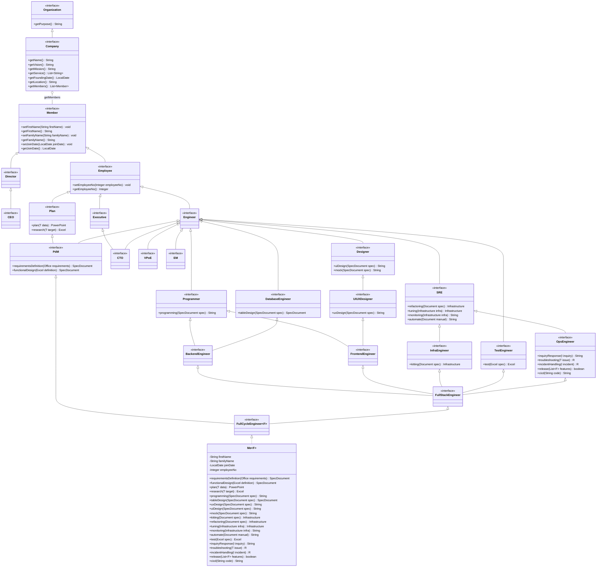
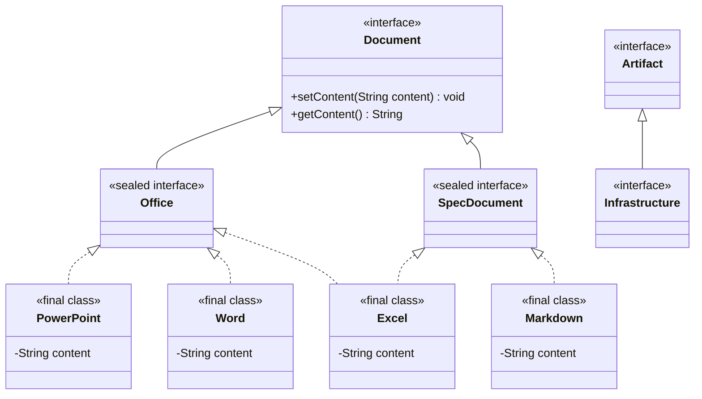

### 1. 全体クラス図（組織・ロール・俺・ドキュメント・成果物）

```mermaid
classDiagram
    direction TB

    %% ==================== Organization ====================
    class Organization {
        <<interface>>
        +getPurpose() String
    }

    class Company {
        <<interface>>
        +getName() String
        +getVision() String
        +getMission() String
        +getService() List~String~
        +getFoundingDate() LocalDate
        +getLocation() String
        +getMembers() List~Member~
    }

    class Member {
        <<interface>>
        +setFirstName(String firstName) void
        +getFirstName() String
        +setFamilyName(String familyName) void
        +getFamilyName() String
        +setJoinDate(LocalDate joinDate) void
        +getJoinDate() LocalDate
    }

    class Employee {
        <<interface>>
        +setEmployeeNo(Integer employeeNo) void
        +getEmployeeNo() Integer
    }

    Organization <|-- Company
    Company o-- Member : getMembers
    Member <|-- Employee

    %% ==================== Roles: Core & Top ====================
    class Director {
        <<interface>>
    }

    class CEO {
        <<interface>>
    }

    class Executive {
        <<interface>>
    }

    Member <|-- Director
    Director <|-- CEO
    Employee <|-- Executive

    %% ==================== Roles: Business ====================
    class Plan {
        <<interface>>
        +plan(T data) PowerPoint
        +research(T target) Excel
    }

    class PdM {
        <<interface>>
        +requirementsDefinition(Office requirements) SpecDocument
        +functionalDesign(Excel definition) SpecDocument
    }

    Employee <|-- Plan
    Plan <|-- PdM

    %% ==================== Roles: Technology / Engineer ====================
    class Engineer {
        <<interface>>
    }

    class CTO {
        <<interface>>
    }

    class VPoE {
        <<interface>>
    }

    class EM {
        <<interface>>
    }

    class Programmer {
        <<interface>>
        +programming(SpecDocument spec) String
    }

    class DatabaseEngineer {
        <<interface>>
        +tableDesign(SpecDocument spec) SpecDocument
    }

    class Designer {
        <<interface>>
        +uiDesign(SpecDocument spec) String
        +mock(SpecDocument spec) String
    }

    class UIUXDesigner {
        <<interface>>
        +uxDesign(SpecDocument spec) String
    }

    class SRE {
        <<interface>>
        +refactoring(Document spec) Infrastructure
        +tuning(Infrastructure infra) Infrastructure
        +monitoring(Infrastructure infra) String
        +automate(Document manual) String
    }

    class InfraEngineer {
        <<interface>>
        +kitting(Document spec) Infrastructure
    }

    class OpsEngineer {
        <<interface>>
        +inquiryResponse(I inquiry) String
        +troubleshooting(T issue) R
        +incidentHandling(I incident) R
        +release(List~F~ features) boolean
        +cicd(String code) String
    }

    class TestEngineer {
        <<interface>>
        +test(Excel spec) Excel
    }

    class BackendEngineer {
        <<interface>>
    }

    class FrontendEngineer {
        <<interface>>
    }

    class FullStackEngineer {
        <<interface>>
    }

    class FullCycleEngineer~F~ {
        <<interface>>
    }

    class Me~F~ {
        -String firstName
        -String familyName
        -LocalDate joinDate
        -Integer employeeNo
        +requirementsDefinition(Office requirements) SpecDocument
        +functionalDesign(Excel definition) SpecDocument
        +plan(T data) PowerPoint
        +research(T target) Excel
        +programming(SpecDocument spec) String
        +tableDesign(SpecDocument spec) SpecDocument
        +uxDesign(SpecDocument spec) String
        +uiDesign(SpecDocument spec) String
        +mock(SpecDocument spec) String
        +kitting(Document spec) Infrastructure
        +refactoring(Document spec) Infrastructure
        +tuning(Infrastructure infra) Infrastructure
        +monitoring(Infrastructure infra) String
        +automate(Document manual) String
        +test(Excel spec) Excel
        +inquiryResponse(I inquiry) String
        +troubleshooting(T issue) R
        +incidentHandling(I incident) R
        +release(List~F~ features) boolean
        +cicd(String code) String
    }

    Employee <|-- Engineer
    Executive <|-- CTO
    Engineer <|-- CTO
    Engineer <|-- VPoE
    Engineer <|-- EM
    Engineer <|-- PdM
    Engineer <|-- Programmer
    Engineer <|-- DatabaseEngineer
    Engineer <|-- Designer
    Engineer <|-- SRE
    Engineer <|-- TestEngineer

    Designer <|-- UIUXDesigner

    Programmer <|-- BackendEngineer
    DatabaseEngineer <|-- BackendEngineer

    Programmer <|-- FrontendEngineer
    UIUXDesigner <|-- FrontendEngineer

    SRE <|-- InfraEngineer
    SRE <|-- OpsEngineer

    BackendEngineer <|-- FullStackEngineer
    FrontendEngineer <|-- FullStackEngineer
    InfraEngineer <|-- FullStackEngineer
    TestEngineer <|-- FullStackEngineer
    OpsEngineer <|-- FullStackEngineer

    PdM <|-- FullCycleEngineer
    FullStackEngineer <|-- FullCycleEngineer
    FullCycleEngineer <|.. Me
```

---

### 2. ドキュメント・成果物（`document` / `artifact`）のクラス図

```mermaid
classDiagram
    direction TB

    class Document {
        <<interface>>
        +setContent(String content) void
        +getContent() String
    }

    class Office {
        <<sealed interface>>
    }

    class SpecDocument {
        <<sealed interface>>
    }

    class PowerPoint {
        <<final class>>
        -String content
    }

    class Word {
        <<final class>>
        -String content
    }

    class Excel {
        <<final class>>
        -String content
    }

    class Markdown {
        <<final class>>
        -String content
    }

    class Artifact {
        <<interface>>
    }

    class Infrastructure {
        <<interface>>
    }

    Document <|-- Office
    Document <|-- SpecDocument

    Office <|.. PowerPoint
    Office <|.. Word
    Office <|.. Excel
    SpecDocument <|.. Excel
    SpecDocument <|.. Markdown

    Artifact <|-- Infrastructure
```