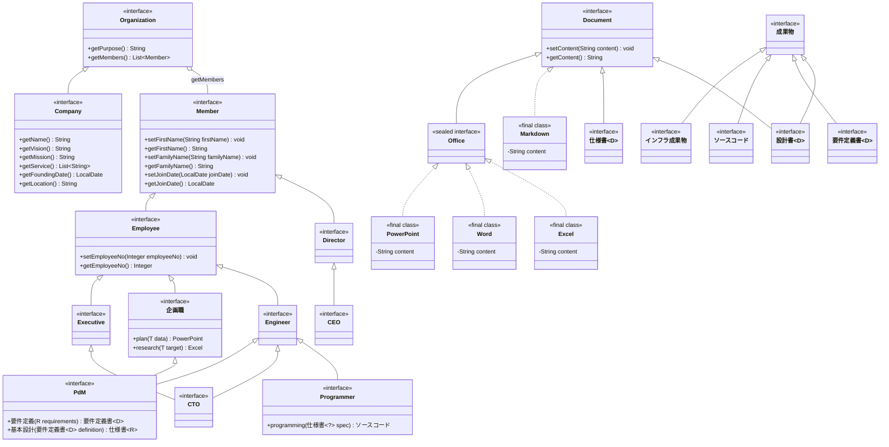
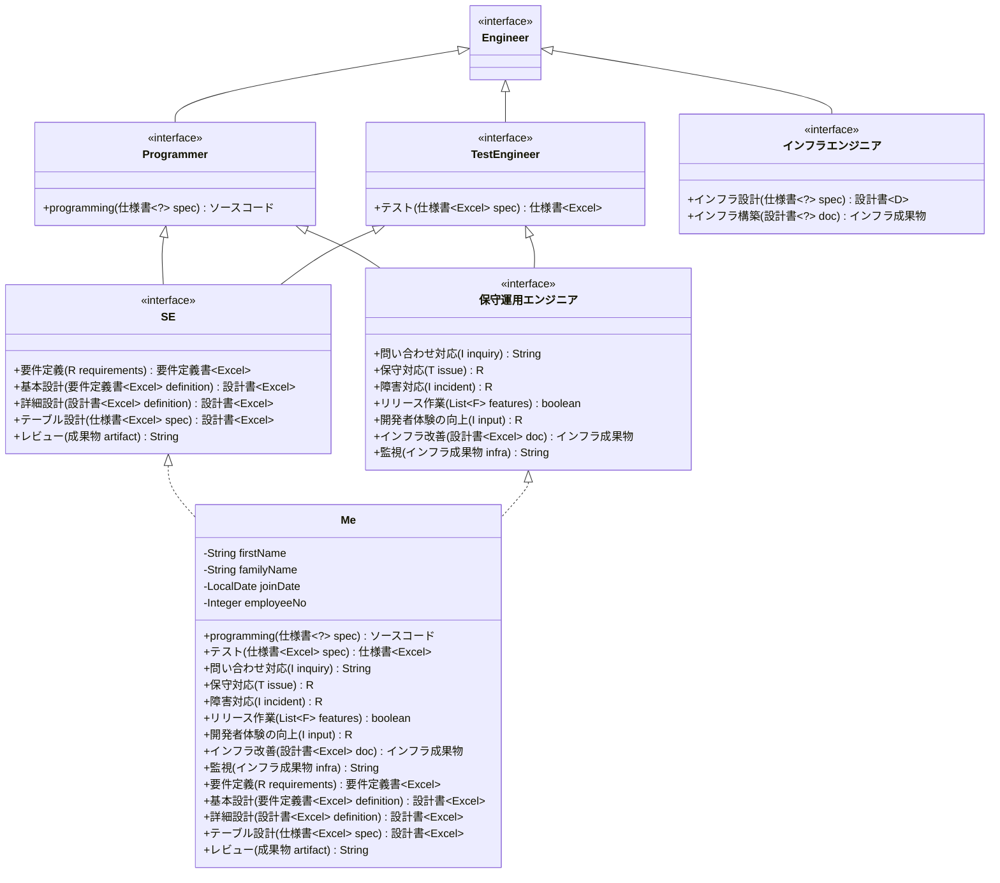

### 1. 共通モジュール（`core`）のクラス図

```mermaid
classDiagram
    direction TB

    %% ==================== Organization ====================
    class Organization {
        <<interface>>
        +getPurpose() String
        +getMembers() List~Member~
    }

    class Company {
        <<interface>>
        +getName() String
        +getVision() String
        +getMission() String
        +getService() List~String~
        +getFoundingDate() LocalDate
        +getLocation() String
    }

    class Member {
        <<interface>>
        +setFirstName(String firstName) void
        +getFirstName() String
        +setFamilyName(String familyName) void
        +getFamilyName() String
        +setJoinDate(LocalDate joinDate) void
        +getJoinDate() LocalDate
    }

    class Employee {
        <<interface>>
        +setEmployeeNo(Integer employeeNo) void
        +getEmployeeNo() Integer
    }

    Organization <|-- Company
    Organization o-- Member : getMembers
    Member <|-- Employee

    %% ==================== Roles: Core & Business & Technology ====================
    class Director {
        <<interface>>
    }

    class CEO {
        <<interface>>
    }

    class Executive {
        <<interface>>
    }

    class 企画職 {
        <<interface>>
        +plan(T data) PowerPoint
        +research(T target) Excel
    }

    class PdM {
        <<interface>>
        +要件定義(R requirements) 要件定義書~D~
        +基本設計(要件定義書~D~ definition) 仕様書~R~
    }

    class Engineer {
        <<interface>>
    }

    class CTO {
        <<interface>>
    }

    class Programmer {
        <<interface>>
        +programming(仕様書~?~ spec) ソースコード
    }

    Member <|-- Director
    Director <|-- CEO
    Employee <|-- Executive
    Employee <|-- 企画職
    Employee <|-- Engineer
    企画職 <|-- PdM
    Engineer <|-- PdM
    Executive <|-- CTO
    Engineer <|-- CTO
    Engineer <|-- Programmer

    %% ==================== Document & Artifacts ====================
    class Document {
        <<interface>>
        +setContent(String content) void
        +getContent() String
    }

    class Office {
        <<sealed interface>>
    }

    class PowerPoint {
        <<final class>>
        -String content
    }

    class Word {
        <<final class>>
        -String content
    }

    class Excel {
        <<final class>>
        -String content
    }

    class Markdown {
        <<final class>>
        -String content
    }

    class 成果物 {
        <<interface>>
    }

    class インフラ成果物 {
        <<interface>>
    }

    class ソースコード {
        <<interface>>
    }

    class 要件定義書~D~ {
        <<interface>>
    }

    class 仕様書~D~ {
        <<interface>>
    }

    class 設計書~D~ {
        <<interface>>
    }

    Document <|-- Office
    Office <|.. PowerPoint
    Office <|.. Word
    Office <|.. Excel
    Document <|.. Markdown

    Document <|-- 仕様書
    Document <|-- 設計書
    成果物 <|-- インフラ成果物
    成果物 <|-- ソースコード
    成果物 <|-- 要件定義書
    成果物 <|-- 設計書
```

---

### 2. SIerモジュール（`sier`）のクラス図

```mermaid
classDiagram
    direction TB

    %% ==================== Core References ====================
    class Engineer {
        <<interface>>
    }

    class Programmer {
        <<interface>>
        +programming(仕様書~?~ spec) ソースコード
    }

    %% ==================== SIer Engineer Roles ====================
    class TestEngineer {
        <<interface>>
        +テスト(仕様書~Excel~ spec) 仕様書~Excel~
    }

    class インフラエンジニア {
        <<interface>>
        +インフラ設計(仕様書~?~ spec) 設計書~D~
        +インフラ構築(設計書~?~ doc) インフラ成果物
    }

    class SE {
        <<interface>>
        +要件定義(R requirements) 要件定義書~Excel~
        +基本設計(要件定義書~Excel~ definition) 設計書~Excel~
        +詳細設計(設計書~Excel~ definition) 設計書~Excel~
        +テーブル設計(仕様書~Excel~ spec) 設計書~Excel~
        +レビュー(成果物 artifact) String
    }

    class 保守運用エンジニア {
        <<interface>>
        +問い合わせ対応(I inquiry) String
        +保守対応(T issue) R
        +障害対応(I incident) R
        +リリース作業(List~F~ features) boolean
        +開発者体験の向上(I input) R
        +インフラ改善(設計書~Excel~ doc) インフラ成果物
        +監視(インフラ成果物 infra) String
    }

    class Me {
        -String firstName
        -String familyName
        -LocalDate joinDate
        -Integer employeeNo
        +programming(仕様書~?~ spec) ソースコード
        +テスト(仕様書~Excel~ spec) 仕様書~Excel~
        +問い合わせ対応(I inquiry) String
        +保守対応(T issue) R
        +障害対応(I incident) R
        +リリース作業(List~F~ features) boolean
        +開発者体験の向上(I input) R
        +インフラ改善(設計書~Excel~ doc) インフラ成果物
        +監視(インフラ成果物 infra) String
        +要件定義(R requirements) 要件定義書~Excel~
        +基本設計(要件定義書~Excel~ definition) 設計書~Excel~
        +詳細設計(設計書~Excel~ definition) 設計書~Excel~
        +テーブル設計(仕様書~Excel~ spec) 設計書~Excel~
        +レビュー(成果物 artifact) String
    }

    Engineer <|-- Programmer
    Engineer <|-- TestEngineer
    Engineer <|-- インフラエンジニア

    Programmer <|-- SE
    TestEngineer <|-- SE

    Programmer <|-- 保守運用エンジニア
    TestEngineer <|-- 保守運用エンジニア

    SE <|.. Me
    保守運用エンジニア <|.. Me
```
